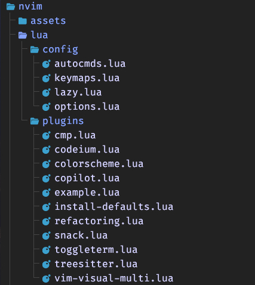

# 💤 My LazyVim Configuration

This is my custom [LazyVim](https://github.com/LazyVim/LazyVim) setup designed to boost productivity and provide a delightful development experience with modern Neovim.

## 📁 Directory Structure

Here's a quick breakdown of the structure:



## 🔌 Plugins

Some of the notable plugins configured:

- **cmp.lua** – Autocompletion (likely using `nvim-cmp`)
- **codeium.lua / copilot.lua** – AI code assistants
- **colorscheme.lua** – Theme configuration
- **toggleterm.lua** – Integrated terminal management
- **treesitter.lua** – Syntax parsing and highlighting
- **refactoring.lua** – Refactoring tools
- **vim-visual-multi.lua** – Multi-cursor support

## 🛠 Features

- Custom keymaps for productivity
- AI-powered code suggestions
- Code formatting with `stylua`
- Built-in terminal and refactoring utilities
- Snippet support (see `snack.lua`)
- Visual multi-cursor editing

## 🚀 Getting Started

### Prerequisites

- [Neovim 0.9+](https://neovim.io/)
- Git
- `ripgrep`, `fd`, and other common CLI tools

### Installation

```bash
git clone https://github.com/shashinvision/lazyvimCustomConfig.git ~/.config/nvim
nvim

```
