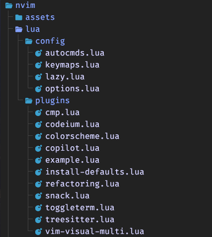

#### Click para [Version en español](./README.md)

# 💤 My LazyVim Configuration

This is my custom [LazyVim](https://github.com/LazyVim/LazyVim) setup designed to boost productivity and provide a delightful development experience with modern Neovim.

If you wanna learn more about Vim/NeoVIM, you can follow this spanish free course about [Vim y NeoVim Fácil](https://youtube.com/playlist?list=PLt8PjPook45ZemtwXONrL5mrN-NTd71Lo&si=CKZKMrOKoWXqQ2Tw) for the community.

## 📁 Directory Structure

Here's a quick breakdown of the structure:



## 🔌 Plugins

Some of the notable plugins configured:

- **cmp.lua** – Autocompletion (likely using `nvim-cmp`)
- **codeium.lua / copilot.lua** – AI code assistants
- **colorscheme.lua** – Theme configuration
- **toggleterm.lua** – Integrated terminal management
- **treesitter.lua** – Syntax parsing and highlighting
- **refactoring.lua** – Refactoring tools
- **vim-visual-multi.lua** – Multi-cursor support

## 🛠 Features

- Custom keymaps for productivity
- AI-powered code suggestions
- Code formatting with `stylua`
- Built-in terminal and refactoring utilities
- Snippet support (see `snack.lua`)
- Visual multi-cursor editing

## 🚀 Getting Started

### Prerequisites

- [Neovim 0.9+](https://neovim.io/)
- Git
- `LazyGit`, `ripgrep`, `fd`, and other common CLI tools
- With copilot you need this :copilot auth

### Installation

- Powered by [LazyVim.com](https://www.lazyvim.org/installation)

```bash
# required
mv ~/.config/nvim{,.bak}

# optional but recommended
mv ~/.local/share/nvim{,.bak}
mv ~/.local/state/nvim{,.bak}
mv ~/.cache/nvim{,.bak}
```

```bash
git clone https://github.com/shashinvision/lazyvimCustomConfig.git ~/.config/nvim
nvim
```

- If you wanna use you own repo based on this project, you can use the following command:

```bash
rm -rf ~/.config/nvim/.git

```

- Mac errores in this Version
  Edit this line

```
nvim ~/.local/share/nvim/lazy/LazyVim/lua/lazyvim/plugins/lsp/init.lua
```

Replace this

```
vim.lsp.inlay_hint.enable(buffer, true)
```

for this

```
if vim.lsp.inlay_hint and type(vim.lsp.inlay_hint.enable) == "function" then
  vim.lsp.inlay_hint.enable(buffer, true)
end
```

## Warning just if on Linux or mac show errors with C# omnisharp on NeoVim/LazyVim

```bash
sudo apt update
sudo apt install mono-complete
```

Or on Mac

```bash
brew install mono
```

- C#

```bash
dotnet tool install -g dotnet-omnisharp
```

```bash
# Download the latest version of omnisharp-roslyn
git clone https://github.com/OmniSharp/omnisharp-roslyn.git
cd omnisharp-roslyn
./build.sh
```
